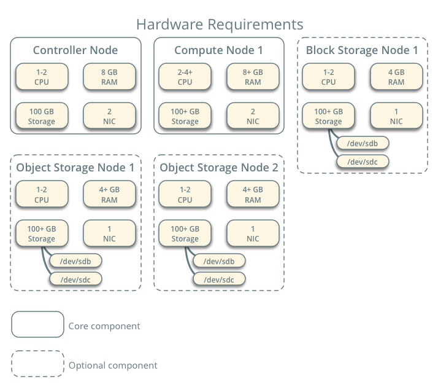

# openstack学习笔记

## 学习进度

- [x] `openstack`总述（概念、语言、支持环境等）
- [x] `openstack insatallation in ubuntu`（版本、支持的service、示例架构及硬件需求等）

## 总述

+ **OpenStack**是[美国国家航空航天局](https://zh.wikipedia.org/wiki/美國太空總署)和[Rackspace](https://zh.wikipedia.org/wiki/Rackspace)合作研发的[云计算](https://zh.wikipedia.org/wiki/雲端運算)软件，以[Apache授权条款](https://zh.wikipedia.org/wiki/Apache授權條款)授权，并且是[自由](https://zh.wikipedia.org/wiki/自由軟件)和[开放源代码软件](https://zh.wikipedia.org/wiki/开放源代码软件)。
  
  + **云计算**（英语：cloud computing[[1\]](https://zh.wikipedia.org/wiki/雲端運算#cite_note-杨正洪周发武2011-1)），也被意译为**网络计算**[[2\]](https://zh.wikipedia.org/wiki/雲端運算#cite_note-2)，是一种基于[互联网](https://zh.wikipedia.org/wiki/互联网)的计算方式，通过这种方式，共享的软硬件资源和信息可以按需求提供给计算机各种终端和其他设备，使用服务商提供的电脑基建作计算和资源。
  
+ 以[Python](https://zh.wikipedia.org/wiki/Python)[编程语言](https://zh.wikipedia.org/wiki/程式語言)编写

+ 集成[Tornado](https://zh.wikipedia.org/wiki/Tornado)[网页服务器](https://zh.wikipedia.org/wiki/網頁伺服器)、[Nebula运算平台](https://zh.wikipedia.org/w/index.php?title=Nebula_(運算平台)&action=edit&redlink=1)

+ 使用Twisted软件[框架](https://zh.wikipedia.org/wiki/框架)
  
  + **Twisted** 是一个[事件驱动](https://zh.wikipedia.org/wiki/事件驅動)的[网络编程](https://zh.wikipedia.org/w/index.php?title=网络编程&action=edit&redlink=1)[框架](https://zh.wikipedia.org/wiki/软件框架)，它使用[编程语言](https://zh.wikipedia.org/wiki/编程语言)[Python](https://zh.wikipedia.org/wiki/Python)编写，并在[MIT协议](https://zh.wikipedia.org/wiki/MIT_License)下开源。
  
+ 遵循Open Virtualization Format、AMQP、[SQLAlchemy](https://zh.wikipedia.org/wiki/SQLAlchemy)等标准

+ [虚拟机](https://zh.wikipedia.org/wiki/虛擬機器)软件支持包括：[KVM](https://zh.wikipedia.org/wiki/Kernel-based_Virtual_Machine)、[Xen](https://zh.wikipedia.org/wiki/Xen)、[VirtualBox](https://zh.wikipedia.org/wiki/VirtualBox)、[VMware](https://zh.wikipedia.org/wiki/VMware)、Hyper-V

+ Openstack控制着大型的计算，存储和网络资源池，所有这些都通过API或仪表板进行管理。

  

## installation in ubuntu

+ OpenStack的稳5261定版4102一般需要倒推一个版本1653，4月上线的mitaka版本，所以目前稳定版就是liberty。所以接下来学习`liberty`的指南

+ OpenStack系统由几个关键服务组成，它们可以单独安装。这些服务根据你的云需求工作在一起。这些服务包括计算服务、认证服务、网络服务、镜像服务、块存储服务、对象存储服务、计量服务、编排服务和数据库服务。您可以独立安装这些服务、独自配置它们或者连接成一个整体。

### **OpenStack services**

+ | 服务                                                         | 项目名称                                                     | 描述                                                         |
  | :----------------------------------------------------------- | :----------------------------------------------------------- | :----------------------------------------------------------- |
  | [`仪表盘`_](https://docs.openstack.org/liberty/zh_CN/install-guide-ubuntu/overview.html#id5) | [Horizon](http://docs.openstack.org/developer/horizon/)      | 提供了一个基于web的自服务门户，与OpenStack底层服务交互，诸如启动一个实例，分配IP地址以及配置访问控制。 |
  | [Compute](http://www.openstack.org/software/releases/liberty/components/nova) | [Nova](http://docs.openstack.org/developer/nova/)            | 在OpenStack环境中计算实例的生命周期管理。按需响应包括生成、调度、回收虚拟机等操作。 |
  | [Networking](http://www.openstack.org/software/releases/liberty/components/neutron) | [Neutron](http://docs.openstack.org/developer/neutron/)      | 确保为其它OpenStack服务提供网络连接即服务，比如OpenStack计算。为用户提供API定义网络和使用。基于插件的架构其支持众多的网络提供商和技术。 |
  |                                                              |                                                              | 存储                                                         |
  | [Object Storage](http://www.openstack.org/software/releases/liberty/components/swift) | [Swift](http://docs.openstack.org/developer/swift/)          | 通过一个 [*RESTful*](https://docs.openstack.org/liberty/zh_CN/install-guide-ubuntu/common/glossary.html#term-restful),基于HTTP的应用程序接口存储和任意检索的非结构化数据对象。它拥有高容错机制，基于数据复制和可扩展架构。它的实现并像是一个文件服务器需要挂载目录。在此种方式下，它写入对象和文件到多个硬盘中，以确保数据是在集群内跨服务器的多份复制。 |
  | [Block Storage](http://www.openstack.org/software/releases/liberty/components/cinder) | [Cinder](http://docs.openstack.org/developer/cinder/)        | 为运行实例而提供的持久性块存储。它的可插拔驱动架构的功能有助于创建和管理块存储设备。 |
  |                                                              |                                                              | 共享服务                                                     |
  | [Identity service](http://www.openstack.org/software/releases/liberty/components/keystone) | [Keystone](http://docs.openstack.org/developer/keystone/)    | 为其他OpenStack服务提供认证和授权服务，为所有的OpenStack服务提供一个端点目录。 |
  | [Image service](http://www.openstack.org/software/releases/liberty/components/glance) | [Glance](http://docs.openstack.org/developer/glance/)        | 存储和检索虚拟机磁盘镜像，OpenStack计算会在实例部署时使用此服务。 |
  | [Telemetry](http://www.openstack.org/software/releases/liberty/components/ceilometer) | [Ceilometer](http://docs.openstack.org/developer/ceilometer/) | 为OpenStack云的计费、基准、扩展性以及统计等目的提供监测和计量。 |
  |                                                              |                                                              | 高层次服务                                                   |
  | [Orchestration](http://www.openstack.org/software/releases/liberty/components/heat) | [Heat](http://docs.openstack.org/developer/heat/)            | 既可以使用本地 :term:[`](https://docs.openstack.org/liberty/zh_CN/install-guide-ubuntu/overview.html#id1)HOT <Heat Orchestration Template (HOT)>`模板格式，亦可使用AWS CloudFormation模板格式，来编排多个综合的云应用，通过OpenStack本地REST API或者是CloudFormation相兼容的队列API。 |

  在对这些OpenStack服务基础安装，配置，操作和故障诊断熟悉后，使用生产架构部署时你应该考虑下面的几个步骤。

  - 确定并实施必要的核心和可选服务，以满足性能和冗余要求。
  - 使用诸如防火墙，加密和服务策略的方式加强安全。
  - 使用自动化工具，如 Ansible，Chef ， Puppet 或者Salt实现自动部署和管理生产环境。

###  示例架构

  

###  硬件需求

  + 控制器

    + 控制节点上运行身份认证服务，镜像服务，计算服务的管理部分，网络服务的管理部分，多种网络代理以及仪表板。也需要包含一些支持服务，例如：SQL数据库，term:消息队列, and [*NTP*](https://docs.openstack.org/mitaka/zh_CN/install-guide-ubuntu/common/glossary.html#term-ntp)。

+ 计算

  + 计算节点上运行计算服务中管理实例的管理程序部分。默认情况下，计算服务使用 *KVM*。可以在计算节点上运行部分块存储，对象存储，Orchestration 和 Telemetry 服务。
  + 可以部署超过一个计算节点。每个结算节点`至少需要两块网卡`。

+ 块设备存储

  + 可选的块存储节点上包含了磁盘，块存储服务和共享文件系统会向实例提供这些磁盘。
  + 为了简单起见，计算节点和本节点之间的服务流量使用管理网络。生产环境中应该部署一个单独的存储网络以增强性能和安全。
  + 可以部署超过一个块存储节点。每个块存储节点要求`至少一块网卡`。

+ 对象存储

  + 可选的对象存储节点包含了磁盘。对象存储服务用这些磁盘来存储账号，容器和对象。
  + 为了简单起见，计算节点和本节点之间的服务流量使用管理网络。生产环境中应该部署一个单独的存储网络以增强性能和安全。
  + 这个服务要求两个节点。每个节点要求最少一块网卡。你可以部署超过两个对象存储节点。

+ 网络

  + 提供网络者：提供者网络选项以最简单的方式部署OpenStack网络服务，可能包括二层服务(桥/交换机)服务、VLAN网络分段。本质上，它建立虚拟网络到物理网络的桥，依靠物理网络基础设施提供三层服务(路由)。额外地 ，:term:[`](https://docs.openstack.org/liberty/zh_CN/install-guide-ubuntu/overview.html#id1)DHCP`为实例提供IP地址信息。

    > 这个选项不支持私有网络，layer-3服务以及一些高级服务，例如:term:LBaaS and [*FWaaS*](https://docs.openstack.org/mitaka/zh_CN/install-guide-ubuntu/common/glossary.html#term-fwaas)。如果你需要这些服务，请考虑私有网络选项

    

  + 自服务网络：自服务网络选项扩展提供者网络选项，三层网络服务启用 *self-service`网络使用叠加分段方法，比如 :term:`VXLAN*。本质上，它使用 :term:[`](https://docs.openstack.org/liberty/zh_CN/install-guide-ubuntu/overview.html#id1)NAT`路由虚拟网络到路由物理网络。额外地，这个选项提供高级服务的基础，比如LBaas和FWaaS。
  
    

## 参考资料

+ [openstack wiki](https://zh.wikipedia.org/wiki/OpenStack)
+ [twisted wiki](https://zh.wikipedia.org/wiki/Twisted)
+ [openstack](https://www.openstack.org/)
+ [openstack部署实践](https://gtcsq.readthedocs.io/en/latest/openstack/deploy_synopsis.html)
+ [openstack installation in ubuntu](https://docs.openstack.org/mitaka/zh_CN/install-guide-ubuntu/)
+ [liberty-openstack](https://docs.openstack.org/liberty/zh_CN/install-guide-ubuntu/overview.html)